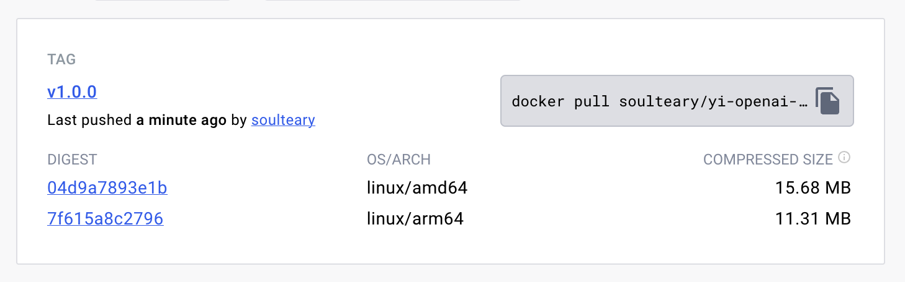

# YI OpenAI Proxy

Yi OpenAI Proxy，将零一万物 YI-34B 模型 API 转换为各种使用 OpenAI API 的开源软件支持的格式，无需修改开源软件配置或代码。

10 来 MB 的小工具，让你几乎无成本的使用各种 AI 应用。

*只需要配置两个环境变量，一键启动，开始畅玩 AI Native 应用🚀。*



[请前往新项目](https://github.com/soulteary/amazing-openai-api)，同时支持多种模型 🎉

## 当前验证可玩开源项目（持更，欢迎 PR）

| 开源项目                                                  | 适配状态 |
| -------------------------------------------------------- | ------ |
| [chatgpt-web](https://github.com/Chanzhaoyu/chatgpt-web) | ✅ |
| [chatbox](https://github.com/Bin-Huang/chatbox)          | ✅ |
| [langchain](https://python.langchain.com/en/latest/)     | ✅ |
| [ChatGPT-Next-Web](https://github.com/Yidadaa/ChatGPT-Next-Web) | ✅ |

## 软件下载

你可以在 GitHub Release 页面下载构建好的二进制可执行文件，在你的机器直接运行。

也可以使用 Docker Pull，下载 GitHub CI 自动构建好的小巧的容器镜像。

```bash
docker pull soulteary/yi-openai-proxy:v1.0.0
```

## 快速上手

如果你直接下载和使用二进制可执行，那么使用命令启动即可：

```bash
YI_ENDPOINT=https://你申请到的API地址 YI_API_KEY=你申请到的API_KEY ./yi-openai-proxy

```

如果你使用容器，可以使用下面的命令一键启动：

```bash
docker run --rm -e YI_ENDPOINT=https://你申请到的API地址 YI_API_KEY=你申请到的API_KEY soulteary/yi-openai-proxy:v1.0.0
```

当然，如果你喜欢声明式的配置，使用下面的 `docker-compose.yml` 配置会更直观：

```yaml
version: "3"

services:
  yi-openai-proxy:
    image: soulteary/yi-openai-proxy:v1.0.0
    restart: always
    ports:
      - "8080:8080"
    environment:
      # 使用以 `https://` 开头的 YI-34B API 地址
      - YI_ENDPOINT=https://<YI_API_URL>
      # 如果你定义了这个参数，那么你的程序在调用 “API” 的时候，就不需要携带 KEY 的内容了，或者随意写都行，这样就不会把 KEY 泄漏给应用了。更方便，也更安全。
      - YI_API_KEY=<YI API Key>
```

## 调用验证

我们可以使用 `curl` 来方便的模拟 SDK 或者应用访问，比如执行：

```bash
curl --location --request POST 'localhost:8080/v1/chat/completions' \
-H 'Authorization: Bearer <你的 API Key>' \
-H 'Content-Type: application/json' \
-d '{
    "max_tokens": 1000,
    "model": "gpt-3.5-turbo",
    "temperature": 0.8,
    "top_p": 1,
    "presence_penalty": 1,
    "messages": [
        {
            "role": "user",
            "content": "Hello"
        }
    ],
    "stream": true
}'
```

虽然上面我们写的模型是 `gpt-3.5-turbo`，甚至我们没有正确填写 API Key，如果你在启动服务的时候，已经配置好了 `YI_API_KEY` 环境变量，因为通过了这个服务的处理，我们想用的开源软件就能够实现不修改代码或者逻辑，直接复用 YI。

### 使用 ChatGPT-Next-Web


docker-compose.yml

````yaml
version: '3'

services:
  chatgpt-web:
    image: yidadaa/chatgpt-next-web
    ports:
      - 3000:3000
    environment:
      API_KEY: <Yi API Key>
      BASE_URL: http://yi-openai-proxy:8080
      CODE: ""
      HIDE_USER_API_KEY: 1
      HIDE_BALANCE_QUERY: 1
    depends_on:
      - yi-openai-proxy
    links:
      - yi-openai-proxy
    networks:
      - chatgpt-ns

  yi-openai-proxy:
    image: soulteary/yi-openai-proxy:v1.0.0
    restart: always
    ports:
      - "8080:8080"
    environment:
      # 使用以 `https://` 开头的 YI-34B API 地址
      - YI_ENDPOINT=https://<YI_API_URL>
      # 如果你定义了这个参数，那么你的程序在调用 “API” 的时候，就不需要携带 KEY 的内容了，或者随意写都行，这样就不会把 KEY 泄漏给应用了。更方便，也更安全。
      - YI_API_KEY=<YI API Key>
    networks:
      - chatgpt-ns

networks:
  chatgpt-ns:
    driver: bridge
````

### 使用 ChatGPT-Web

ChatGPT Web: https://github.com/Chanzhaoyu/chatgpt-web

docker-compose.yml:

````yaml
version: '3'

services:
  chatgpt-web:
    image: chenzhaoyu94/chatgpt-web
    ports:
      - 3002:3002
    environment:
      API_KEY: <Yi API Key>
      API_BASE_URL: http://yi-openai-proxy:8080
      # API_MODEL: gpt-4
      AUTH_SECRET_KEY: ""
      MAX_REQUEST_PER_HOUR: 1000
      TIMEOUT_MS: 60000
    depends_on:
      - yi-openai-proxy
    links:
      - yi-openai-proxy
    networks:
      - chatgpt-ns

  yi-openai-proxy:
    image: soulteary/yi-openai-proxy:v1.0.0
    restart: always
    ports:
      - "8080:8080"
    environment:
      # 使用以 `https://` 开头的 YI-34B API 地址
      - YI_ENDPOINT=https://<YI_API_URL>
      # 如果你定义了这个参数，那么你的程序在调用 “API” 的时候，就不需要携带 KEY 的内容了，或者随意写都行，这样就不会把 KEY 泄漏给应用了。更方便，也更安全。
      - YI_API_KEY=<YI API Key>
    networks:
      - chatgpt-ns

networks:
  chatgpt-ns:
    driver: bridge
````

## 感谢

项目借鉴和修改自下面两个项目，感谢 `stulzq` 的创意 ❤️：

- [stulzq/azure-openai-proxy](https://github.com/stulzq/azure-openai-proxy)。
- [soulteary/azure-openai-proxy](https://github.com/soulteary/azure-openai-proxy)。
